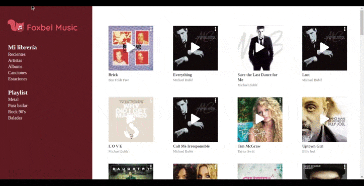

<!--# reto-fractalup

## Project setup
```
npm install
```

### Compiles and hot-reloads for development
```
npm run serve
```

### Compiles and minifies for production
```
npm run build
```

### Run your unit tests
```
npm run test:unit
```

### Lints and fixes files
```
npm run lint
```

### Customize configuration
See [Configuration Reference](https://cli.vuejs.org/config/).
-->

# Reto

<h3 align="center"> Crear una plataforma de música que consuma la Api de deezer , debe estar desarrollada respetando a los wireframes proporcionados en Figma</h3>
<li>Empresa : Fractal Up</li>
<li>Tiempo : 48 horas</li>
<li> Tecnologías : Vue , (para lo estilos , libre elección)</li>
<li>Api : Deezer</li>

## Solución 

<div style="border:2px black solid">

</div>
<br>
<em> Problemas presentados:
<li> Es un poco complicado reproducir los audios de los artistas que se seleccionan </li>
</em>